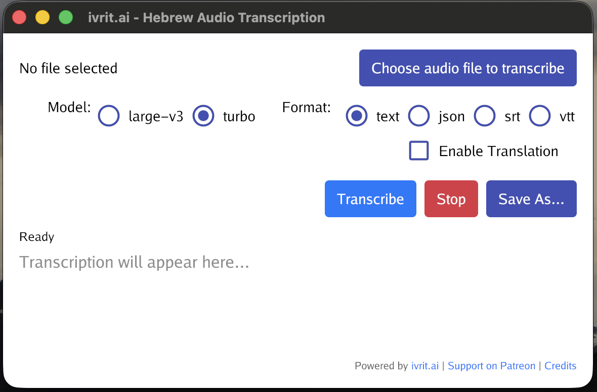

# ivrit.ai Hebrew Transcription

A native desktop application + CLI for transcribing Hebrew audio and video files using OpenAI's Whisper model, optimized for Hebrew with [ivrit.ai](https://ivrit.ai) models.


This has been vibe-coded and hardly tested but hopefully useful to someone.
The Ivrit.ai team is in no way responsible for this. 

## Features

* ✨ **Hebrew-Optimized**: Uses fine-tuned ivrit.ai Whisper models for superior Hebrew transcription
* ⚡ **Real-Time Progress**: Live progress percentage with ETA calculation
* 🎯 **Smart Caching**: Instant results when re-transcribing the same file
* 🗣️ **Speaker Diarization**: Automatic speaker detection using tinydiarize
* 🌍 **Multi-Language Translation**: Translate to English, Spanish, French, German, Arabic, Russian, Chinese via Mistral 8B
* 📊 **Multiple Formats**: Export as Text, JSON, SRT, or VTT
* 🎬 **Video Support**: Automatic audio extraction from video files
* 🚀 **Pure Go**: Single native binary, no Python runtime needed
* 💾 **Model Management**: Automatic model download and caching
* ⌨️ **Dual Mode**: GUI for interactive use, CLI for automation and scripting
* 🔄 **Cross-Platform**: Works on macOS, probably on Linux, and maybe Windows

## Screenshots



## Installation

### Dependencies

The application requires:
- **whisper.cpp** (bundled in releases, or install via Homebrew)
- **ffmpeg** (for video support)
- **ollama** (for built-in translation)

#### macOS
```bash
brew install ollama ffmpeg
```

For development:
```bash
brew install whisper-cpp
```

#### Linux
```bash
# Install ffmpeg
sudo apt-get install ffmpeg
```

#### Windows
```bash
# Install ffmpeg via Chocolatey
choco install ffmpeg
```

### Download

Download the latest release for your platform from the [Releases](https://github.com/ivrit-ai/hebrew-transcription/releases) page.

## Quick Start

### GUI Mode

1. **Launch the application**
   ```bash
   ./ivrit_ai
   ```

2. **Select an audio/video file** using the "Browse..." button

3. **Choose a model**:
   - **Turbo** (recommended): Fast with excellent quality
   - **Large-v3**: Best quality, slower
   - **Base**: Fastest, lower quality

4. **Click "Transcribe"** and wait for results

5. **Optional**: Enable translation to other languages

6. **Save**: Click "Save As..." to export the transcription

### CLI Mode

The application also supports command-line usage for automation and scripting:

```bash
# Basic transcription
./ivrit_ai -input recording.m4a

# Specify model and output format
./ivrit_ai -input video.mp4 -model large-v3 -format srt -output subtitles.srt

# Translate to English (requires Ollama)
./ivrit_ai -input audio.wav -translate -lang en

# Translate without keeping original Hebrew
./ivrit_ai -input audio.wav -translate -keep-original=false

# Use specific number of CPU threads
./ivrit_ai -input recording.m4a -threads 8
```

**CLI Options:**
- `-input` : Input audio/video file path (required)
- `-output` : Output file path (default: auto-generated)
- `-model` : Model to use: `large-v3`, `turbo`, or `base` (default: turbo)
- `-format` : Output format: `text`, `json`, `srt`, or `vtt` (default: text)
- `-translate` : Enable translation using Mistral 8B
- `-lang` : Target language: `en`, `es`, `fr`, `de` (default: en)
- `-keep-original` : Keep original Hebrew text when translating (default: true)
- `-threads` : Number of CPU threads (0 = auto)
- `-help` : Show help message

**CLI Examples:**

```bash
# Process multiple files in a script
for file in *.m4a; do
  ./ivrit_ai -input "$file" -format srt
done

# Automated translation pipeline
./ivrit_ai -input meeting.mp4 \
  -model large-v3 \
  -format vtt \
  -translate \
  -lang en \
  -output meeting_en.vtt

# Quick transcription with base model
./ivrit_ai -input quick_note.m4a -model base
```

## Models

The application uses Hebrew-optimized models from [ivrit.ai](https://ivrit.ai):

| Model | Size | Speed | Quality | Use Case |
|-------|------|-------|---------|----------|
| **Turbo** | 1.6 GB | Fast | Excellent | Recommended for most users |
| **Large-v3** | 3.1 GB | Slower | Best | Maximum accuracy needed |
| **Base** | 140 MB | Fastest | Good | Quick testing, lower quality |

Models are automatically downloaded on first use and cached locally.

### Custom Models

You can add custom models by editing `models.json`:

```json
{
  "models": {
    "my-model": {
      "id": "username/repo-name",
      "file": "ggml-model.bin",
      "localFileName": "my-model.bin",
      "description": "My custom model"
    }
  }
}
```

See [MODELS_CONFIG.md](MODELS_CONFIG.md) for details.

## Features Guide

### Progress Tracking

- **Real-time percentage**: See exact progress (e.g., "Transcribing... 45%")
- **ETA calculation**: Estimated time remaining (e.g., "ETA: 2m 30s")
- **Updates 5x/second**: Smooth, responsive progress display

### Transcription Caching

When you transcribe the same file with the same model again:
- ✅ Results loaded instantly from cache
- ✅ No re-processing needed
- ✅ Saves time and resources

### Speaker Diarization

Automatically detects and labels different speakers:
```
Speaker 1: שלום, מה שלומך?
Speaker 2: בסדר גמור, תודה!
```

### Translation

Translate Hebrew transcriptions to multiple languages:
- English, Spanish, French, German
- Arabic, Russian, Chinese
- Powered by Mistral 8B (requires [Ollama](https://ollama.com))

### Export Formats

**Text**: Plain text with speaker labels
```
Speaker 1: שלום, מה שלומך?
Speaker 2: בסדר גמור, תודה!
```

**JSON**: Structured data with timestamps
```json
[
  {"start": 0.0, "end": 2.5, "text": "שלום, מה שלומך?", "speaker": 1},
  {"start": 2.5, "end": 4.8, "text": "בסדר גמור, תודה!", "speaker": 2}
]
```

**SRT/VTT**: Subtitle formats for video players

## Building from Source

### Quick Start

```bash
# Clone the repository
git clone https://github.com/ivrit-ai/hebrew-transcription.git
cd hebrew-transcription

# Build (macOS or Linux)
./scripts/build.sh

# Run
./ivrit_ai
```

**For detailed build instructions**, including:
- Platform-specific prerequisites
- Docker-based Linux builds
- Multi-architecture builds
- Production releases with GitHub Actions
- Troubleshooting

See **[BUILDING.md](BUILDING.md)** for the complete guide.

## Testing

The project includes a comprehensive test suite covering:
- Core transcription utilities
- CLI functionality
- Model configuration
- Performance benchmarks

```bash
# Run all tests (uses proper CGO flags)
./scripts/test.sh

# Run with coverage
./scripts/test.sh -cover

# Run benchmarks
./scripts/test.sh -bench=. -benchmem
```

See **[TESTING.md](TESTING.md)** for detailed testing documentation.

## Architecture

```
┌─────────────────────────────────────────────┐
│         Gio UI Framework (Go)               │
│  (Progress, ETA, Speaker Labels, RTL Text)  │
└────────────────┬────────────────────────────┘
                 │
                 ▼
┌─────────────────────────────────────────────┐
│     Transcription Engine (Go + CGO)         │
│  • Model caching (thread-safe)              │
│  • Result caching (instant re-transcription)│
│  • Safe atomic progress tracking            │
└────────────────┬────────────────────────────┘
                 │
                 ▼
┌─────────────────────────────────────────────┐
│        whisper.cpp (C/C++)                  │
│  • ivrit.ai Hebrew-optimized models         │
│  • Speaker diarization (tinydiarize)        │
│  • GPU acceleration (Metal/CUDA)            │
└─────────────────────────────────────────────┘
```

## Troubleshooting

### Models not downloading

**Solution**: Check internet connection and ensure you have write permissions to `~/.cache/whisper/`

### Progress not showing

**Solution**: Ensure you're using a recent build with atomic progress tracking

### Crash on large files

**Solution**: This should be fixed in recent versions. If it persists, please report with:
- Audio file length
- Model used
- Error message

### Translation not working

**Solution**: Translation requires [Ollama](https://ollama.com) with Mistral model:
```bash
# Install Ollama
brew install ollama  # macOS
# or download from https://ollama.com

# Start Ollama service
ollama serve

# Pull Mistral model
ollama pull mistral
```

### ffmpeg not found

```bash
# macOS
brew install ffmpeg

# Linux
sudo apt-get install ffmpeg

# Windows
choco install ffmpeg
```

## Technical Details

### Thread Safety

- ✅ **Model contexts**: Protected by mutex, no concurrent `whisper_full()` calls
- ✅ **Progress callbacks**: Atomic-only writes from C, polled by Go goroutine
- ✅ **UI updates**: Thread-safe with mutex protection

### Memory Management

- Transcription cache: Unbounded (stores results per file+model)
- Model cache: All loaded models kept in memory (shared across transcriptions)
- Text display: Limited to 50KB to prevent UI crashes

### CGO Safety

The application uses a safe C↔Go interaction pattern:
1. C callbacks only write to atomic variables (no allocations)
2. Go goroutine polls atomic and updates UI
3. No nested C→Go→C calls
4. No memory allocation during C execution

## Contributing

Contributions are welcome! Please see [CONTRIBUTING.md](CONTRIBUTING.md) for guidelines.

## Credits

- **[ivrit.ai](https://ivrit.ai)**: Hebrew-optimized Whisper models
- **[whisper.cpp](https://github.com/ggerganov/whisper.cpp)**: High-performance Whisper implementation
- **[Gio](https://gioui.org)**: Immediate mode GUI framework for Go
- **[Mistral AI](https://mistral.ai)**: Translation model

## Support

- **Issues**: [GitHub Issues](https://github.com/ivrit-ai/hebrew-transcription/issues)
- **Discussions**: [GitHub Discussions](https://github.com/ivrit-ai/hebrew-transcription/discussions)
- **Support ivrit.ai**: [Patreon](https://patreon.com/ivrit_ai)

## License

MIT License - see [LICENSE](LICENSE) for details.

---

**Made with ❤️ by the ivrit.ai community**
